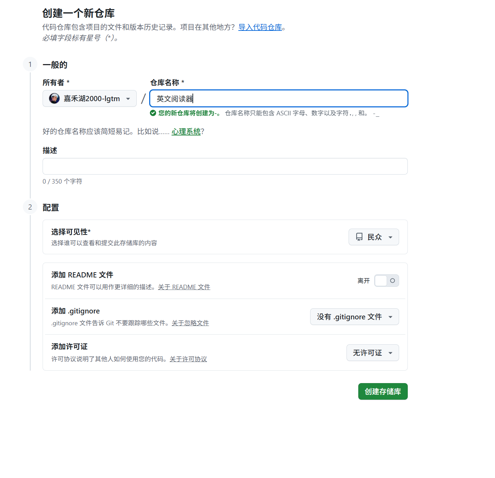

# English Reader

A simple browser-based IELTS reading tool. Import IELTS reading text or PDFs, click any English word to see a Chinese translation, save words to a vocabulary notebook, track review frequency, and export your vocabulary.

If this project helps you, please consider giving it a Star:

[Star this project on GitHub](https://github.com/jiahehu2000-lgtm/English-reader)

## Live Demo

Use it here:

https://jiahehu2000-lgtm.github.io/English-reader/

## Features

- Import reading passages by pasting text, uploading TXT, or uploading PDF.
- Extract the Reading section from IELTS-style PDFs.
- OCR scanned PDF pages in the browser with Tesseract.js.
- Click words in the reading area to show Chinese translations.
- Save words to a vocabulary notebook with frequency counts.
- Search and sort saved vocabulary.
- Export vocabulary as CSV, JSON, or TXT.
- Store articles, translations, and vocabulary locally in the user's browser.

## 中文说明

这是一个适合雅思阅读精读的小工具：

- 可以导入 TXT/PDF 阅读文章。
- 扫描版 PDF 可以用浏览器本地 OCR 识别。
- 点击英文单词显示中文释义。
- 可以把单词加入生词本，并统计记录次数。
- 生词本支持 CSV、JSON、TXT 导出。
- 数据保存在用户自己的浏览器里，不需要注册登录。

如果你觉得这个工具有用，欢迎点 Star：

https://github.com/jiahehu2000-lgtm/English-reader

## Privacy

The app is static and runs in the browser. Vocabulary data is stored in local storage on each user's device. OCR also runs in the browser.

## Copyright Note

This repository provides a reader tool only. Do not publish copyrighted IELTS test PDFs or extracted full test text unless you have the rights to do so.

## Local Use

Open `index.html` directly in a browser.
